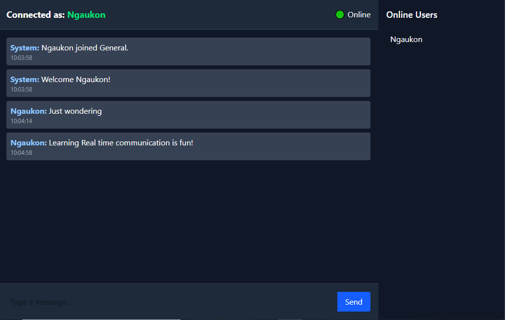

# 💬 Real-Time Chat App (MERN + Socket.io + Tailwind)

A modern real-time chat application built with **MongoDB**, **Express**, **React**, **Node.js**, and **Socket.io**, featuring a **dark, responsive UI** styled with **Tailwind CSS**.
Messages and user activity are synchronized through **WebSockets**, with data persistence in MongoDB.

---

## 🌍 Live Demo

* **Frontend (Vercel):** [https://chat-app-theta-ebon-50.vercel.app/](https://chat-app-theta-ebon-50.vercel.app/)
* **Backend (Render):** [https://your-backend-service.onrender.com](https://your-backend-service.onrender.com) ← *(replace with your actual Render URL)*

> The frontend (Vite + React) is deployed on **Vercel**, while the backend (Express + Socket.io + MongoDB) runs on **Render**.
> Both are connected via environment variables to ensure secure, real-time communication.

---

## 🚀 Project Overview

This project demonstrates a **real-time chat platform** that allows users to:

* Join using a username
* Send and receive messages instantly
* Switch between rooms
* See who is online
* View timestamps from the database
* Persist message history (via MongoDB)
* Experience a clean, modern chat UI

The architecture leverages **Socket.io** for bidirectional communication and **Mongoose** for data persistence.
Both client and server communicate seamlessly to deliver a smooth chatting experience similar to Discord or Slack.

---

## 🖥️ Screenshots

### 🏠 Join Page


### 💬 Chat Interface



---

## 🧱 Tech Stack

| Layer          | Technology                          |
| -------------- | ----------------------------------- |
| **Frontend**   | React (Vite), Tailwind CSS          |
| **Backend**    | Node.js, Express                    |
| **Realtime**   | Socket.io                           |
| **Database**   | MongoDB + Mongoose                  |
| **Styling**    | Tailwind CSS                        |
| **Hosting**    | Vercel (frontend), Render (backend) |
| **State Mgmt** | React hooks & custom Socket context |

---

## ⚙️ Setup Instructions (Local Development)

### 1. Clone the repository

```bash
git clone https://github.com/yourusername/realtime-chat-app.git
cd realtime-chat-app
```

---

### 2. Install dependencies

Install both client and server dependencies:

```bash
# Backend setup
cd server
npm install

# Frontend setup
cd ../client
npm install
```

---

### 3. Configure Environment Variables

#### In `/server/.env`

```env
PORT=5000
MONGO_URI=mongodb://localhost:27017/chatapp
CLIENT_URL=http://localhost:5173
```

#### In `/client/.env`

```env
VITE_BACKEND_URL=http://localhost:5000
```

Make sure MongoDB is running locally, or replace `MONGO_URI` with your Atlas connection string.

---

### 4. Run the application

#### Start the backend (Express + Socket.io)

```bash
cd server
npm run dev
```

#### Start the frontend (React + Vite)

```bash
cd client
npm run dev
```

Then visit 👉 **[http://localhost:5173](http://localhost:5173)**

---

## ☁️ Deployment

### 🖥️ Backend (Render)

1. Go to [Render](https://render.com/) and create a new **Web Service**.
2. Connect your GitHub repository.
3. Set the **Root Directory** to `/server`.
4. Add Environment Variables under **Settings → Environment**:

   ```env
   PORT=10000
   MONGO_URI=your_mongodb_uri
   CLIENT_URL=https://chat-app-theta-ebon-50.vercel.app
   ```
5. Deploy — Render will host your backend and provide a public URL like:

   ```
   https://your-backend-service.onrender.com
   ```

---

### 🌐 Frontend (Vercel)

1. Go to [Vercel](https://vercel.com/).
2. Import your GitHub repository.
3. Set **Root Directory** to `/client`.
4. Under **Environment Variables**, add:

   ```env
   VITE_BACKEND_URL=https://your-backend-service.onrender.com
   ```
5. Deploy — your app will be available at:

   ```
   https://chat-app-theta-ebon-50.vercel.app
   ```

---

## ✨ Features Implemented

### 🧠 Core Features

* **Real-time messaging** via Socket.io
* **Online/offline detection** synced with MongoDB
* **Persistent chat history** (messages stored in DB)
* **Automatic timestamps** for every message
* **System messages** (user join/leave notifications)

### 💬 Chat Functionality

* Join using a custom username
* Send and receive messages instantly
* Switch chat rooms dynamically
* Typing indicators for active users
* Responsive message list with autoscroll

### 🎨 UI/UX Enhancements

* **Dark theme** with Tailwind CSS
* **Message bubbles** with timestamps
* **Online users sidebar** with status indicators
* **Floating input bar** with animated send button
* **Responsive layout** for desktop and mobile

---

## 🧩 Folder Structure

```
root/
├── client/
│   ├── src/
│   │   ├── components/
│   │   │   ├── ChatBox.jsx
│   │   │   ├── MessageList.jsx
│   │   │   ├── TypingIndicator.jsx
│   │   │   └── UserList.jsx
│   │   ├── pages/
│   │   │   └── ChatPage.jsx
│   │   ├── socket/
│   │   │   └── socket.js
│   │   └── index.css
│   ├── vite.config.js
│   └── package.json
│
└── server/
    ├── models/
    │   ├── User.js
    │   └── Message.js
    ├── socket/
    │   └── index.js
    ├── utils/
    │   └── logger.js
    ├── server.js
    ├── .env
    └── package.json
```

---

## 🧠 Future Enhancements

* [ ] Private DMs
* [ ] Chat room management UI
* [ ] Message editing/deletion
* [ ] File/image uploads
* [ ] Authentication (JWT + user sessions)

---

## 📜 License

This project is open-source and available under the **MIT License**.

---

## 👨‍💻 Author

**Joseph Ngaukon**
📧 [josephlucia100@gmail.com](mailto:josephlucia100@gmail.com)
🌐 [GitHub Profile](https://github.com/Ngaukon)

---


